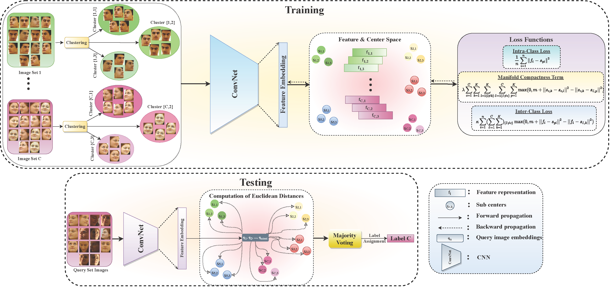

# Deep Discriminative Feature Models (DDFMs) for Set Based Face Recognition and Distance Metric Learning

> **Abstract:** _This paper introduces two methods that find compact deep feature models for approximating images in set based face recognition problems. The proposed method treats each image set as a nonlinear face manifold that is composed of linear components. To find linear components of the face manifold, we first split image sets into subsets containing face images which share similar appearances. Then, our first proposed method approximates each subset by using the center of the deep feature representations of images in those subsets. Centers modeling the subsets are learned by using distance metric learning. The second proposed method uses discriminative common vectors to represent image features in the subsets, and entire subset is approximated with an affine hull in this approach. Discriminative common vectors are subset centers that are projected onto a new feature space where the combined within-class variances coming from all subsets are removed. Our proposed methods can also be considered as distance metric learning methods using triplet loss function where the learned subcluster centers are the selected anchors. This procedure yields to applying distance metric learning to quantized data and brings many advantages over using classical distance metric learning methods. We tested proposed methods on various face recognition problems using image sets and some visual object classification problems. Experimental results show that the proposed methods achieve the state-of-the-art accuracies on the most of the tested image datasets._



Illustration of the proposed method using deep discriminative centers. We first split the face images of the sets into subclusters and then discriminatively learn the deep feature centers representing these subclusters. Here, sets are split into 3 different subclusters. The discriminatively learned centers modeling each subcluster are denoted by sc,k (the center approximating k-th subcluster of the c-th class). During training, the feature embeddings are learned together with the other network weights by using back-propagation. The subcluster centers (sc,k) on the other hand are learned with stochastic gradient descent (SGD) algorithm. During testing phase, the query image features are extracted first by using the trained network and then assigned to the subcluster centers based on the shortest Euclidean distances. The final query set label assignment is accomplished by using the majority voting.

## 1. Requirements

#### Environment

Following packages are required for this repo.

- python 3.8+
- torch 1.9+
- torchvision 0.10+
- CUDA 10.2+
- scikit-learn 0.24+
- catalyst 21.10+
- mlxtend 0.19+

#### Datasets

ESOGU-285 Video:

[Gdrive](https://drive.google.com/file/d/1LnAJhpjqMu-mf2J6YQqh5hmPFUlKAaz5/view?usp=sharing)

After extracting dataset to `./data` folder, the script named `calculate_subclusters.py` needs to be invoked for preparing dataset to be training ready.

## 2. Training & Evaluation

To train and evaluate models in paper, run this command:

### Deep Discriminative Centers (DDCs)

```train_test
python run_ddfm.py --help
```

### Deep Discriminative Common Vectors (DDCVs)

```train_test
python run_ddfm.py --orthonormal --help
```

## 3. Results

#### The learned feature embeddings:


Learned feature representations of image set samples for different methods: (a) the embeddings returned by the proposed method trained with the full loss function, (b) the embeddings returned by the proposed method trained with the loss function without the manifold compactness term, (c) the embeddings returned by the Softmax loss function, (d) the embeddings returned by the Sub-center ArcFace method.

#### Verification Results on IJB-B and IJB-C Dataset:

|  |  |
| --------------------------- | --------------------------- |

#### Identification Results on IJB-B and IJB-C Dataset:

|  |  |
| --------------------------- | --------------------------- |

ROC curves for various tested methods. The ROC curve on the left one is obtained for IJB-B dataset whereas the figure on the right depicts the curve for IJB-C dataset.

## 4. Pretrained Models

Model trained on MS1MV2 with 3 subcluster:

[Gdrive](https://drive.google.com/file/d/1yf7JKTmna_JaZJxnf7IHPP-Uxp6yqBux/view?usp=sharing)
